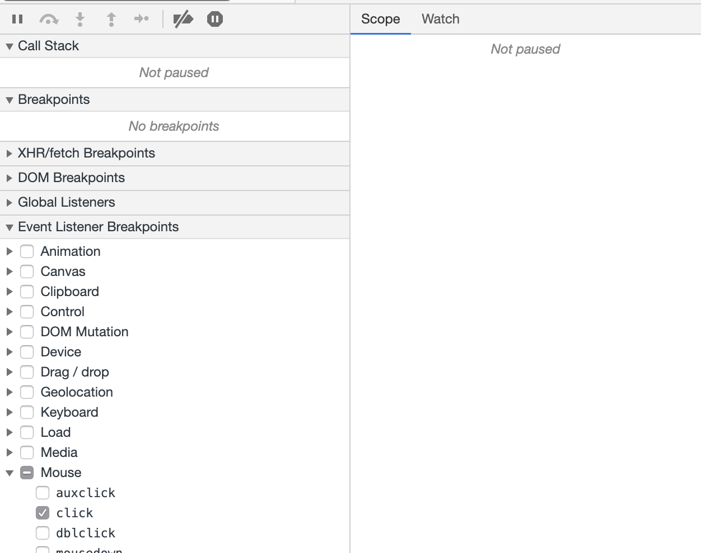
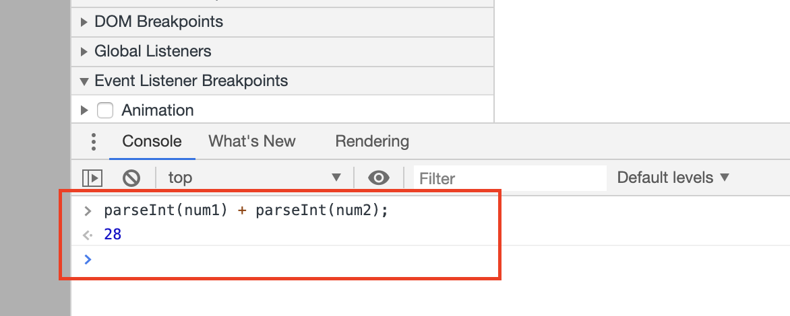

지난 해커톤 경험에서 기억에 남는 것 중 하나는 팀원 분이 크롬에서의 디버깅을 능숙하게 하셨다는 점이다.

이에 자극을 받아 '언젠간 공부해야지' 하고 생각했던 크롬 개발자 도구를 활용한 디버깅을 공부해 보았다.

<br/>

---

## 목차

1. 버그 생성하기!
2. 소스 패널 UI 구경
3. Break point!
4. 변수 값 확인
5. 수정 내용 적용

<br/>

---

## 1. 버그 생성하기!

테스트를 위해 버그가 있는 웹 페이지를 작성했다.

**index.html**

```html
<!DOCTYPE html>
<html>
  <head>
    <title>Debugging</title>
    <meta http-equiv="Content-Type" content="text/html;charset=UTF-8" />
    <link rel="stylesheet" href="style.css" />
  </head>
  <body>
    <h1>Debugging in Chrome!</h1>
    <div>
      <input type="text" name="firstNum" id="firstNum" />
      <span>+</span>
      <input type="text" name="secondNum" id="secondNum" />
      <span>=</span>
      <span id="addResult">0</span>
    </div>
    <button id="addBtn">Add!</button>
    <script src="./index.js"></script>
  </body>
</html>
```

**style.css**

```css
input[type="text"] {
  font-size: 1.5rem;
  width: 6rem;
}

#addResult {
  font-size: 1.5rem;
}
```

**index.js**

```js
const firstNum_input = document.getElementById("firstNum")
const secondNum_input = document.getElementById("secondNum")
const addResult_span = document.getElementById("addResult")
const add_button = document.getElementById("addBtn")

const updateResult = () => {
  let num1 = firstNum_input.value
  let num2 = secondNum_input.value
  let result = num1 + num2
  addResult_span.innerText = result
}

add_button.addEventListener("click", updateResult)
```

<br/>

크롬에서 index.html을 실행시킨 뒤 숫자를 입력하고 Add! 버튼을 클릭했을 때 결과는 아래와 같다.


16이 나오길 기대했지만 142가 나오는 상황이다. 이제 크롬에서 디버깅을 시작해보자!

---

## 2. 소스 패널 UI 구경

크롬 개발자도구는 Mac에서는 `Command + Option + I`(Windows에서는 `Control + Shift + I`) 단축키로 열 수 있다.

Sources 탭을 눌러 열면 아래와 같은 화면이 보인다.


1. File navigator : 해당 페이지가 요청하는 모든 파일이 나열된다.
2. Code editor : File navigator에서 파일을 선택한 후, 해당 파일의 내용이 표시된다.
3. JavaScript debugging : 페이지의 자바스크립트를 검사하는 도구들이 모여있다.

<br/>

---

## 3. Break point!

Break point는 코드 실행 도중 잠시 중단할 위치를 의미한다. 개발자 도구에서는 이벤트 리스너를 기반으로 중단점을 설정하는 방법과 코드에 직접 중단점을 설정하는 방법이 있다.

### 3-1. Event Listener Breakpoints

JavaScript debugging 패널에서 Event Listener Breakpoints를 클릭해 확장해서 Mouse 아래에 있는 click을 체크하자.



이제 클릭 이벤트가 발생하는 모든 곳에서 코드 실행이 중단될 것이다. 다시 Add! 버튼을 누르면 실행이 멈춘다.


코드 실행이 멈춘 상태에서 code editor에서 각 값들에 마우스 커서를 올리면 현재 값에 대해서 알 수 있다.

### 3-2. Line-of-code Breakpoints

일시 중지해서 값을 확인해보고 싶은 코드 줄이 있다면 직접 중단점을 설정할 수 있다.

code editor에서 원하는 줄의 줄 번호를 클릭하면 된다. Event Listener Breakpoints를 해체하고 아래처럼 중단점을 설정했다.


이 후 값을 입력하고 Add! 버튼을 누르면 중단점을 걸어놓은 코드에서 실행이 중단된다.


중단점 이전에 실행된 코드에 대해서는 각 변수들의 값이 나타난다.

num1과 num2의 값이 숫자일 것을 기대했는데 문자열이다. 이제 크롬 개발자 도구에서 변수를 확인하는 방법에 대해 알아보자.

<br/>

---

## 4. 변수 값 확인

### 4-1. Scope

JavaScript debugging 패널 우측에 Scope 탭이 있다. 중단점에 의해 코드 실행이 일시중지 되면 Scope 탭에 현재 정의된 로컬, 전역 변수가 값과 함께 표시된다.

변수 값을 더블클릭해서 편집도 가능하다.


### 4-2. Watch Expressions

Scope 탭 옆에 있는 Watch 탭에서는 표현식을 사용해 변수값과 유효한 표현식을 저장해두고 확인할 수 있다.

Add expression(+ 모양) 버튼을 눌러 변수 또는 표현식을 추가 할 수 있다. result와 typeof result를 추가하면 아래와 같이 결과가 나온다.


result와 타입이 string인 것을 확인했다. 버그의 원인을 알아낸 것이다.

### 4-3. Console

개발자 도구 내에서 Console을 열어 변수 및 임의의 자바스크립트 코드를 작성해 평가할 수 있다.

개발자 도구 Sources 탭에서 esc를 눌러 console 탭을 on/off 할 수 있다.

Console에서 아래와 같이 입력하면 원하는 답이 출력된다.

```js
parseInt(num1) + parseInt(num2)
```



이제 코드를 어떻게 수정해야 할지 알아냈다. 코드를 수정해 적용해보고 테스트 해보자.

<br/>

---

## 5. 수정 내용 적용

파일의 내용을 직접 수정하지 않고 개발자 도구 내에서 코드를 수정한 뒤 결과를 확인해볼 수 있다.
Code editor 패널에서 코드 내용을 다음과 같이 수정한다.

```js
...
  let result = parseInt(num1) + parseInt(num2);
...
```


Command + S (Mac 기준)를 눌러 변경 사항을 저장한다.

그 뒤 새로고침을 하지 않은채 값을 넣어 Add! 버튼을 눌러 결과를 확인해보자.


결과가 제대로 출력된다! 수정 했을 때의 결과를 확인했으므로 파일에서 수정하면 디버깅이 끝났다!

<br/>

---

## 마치며

크롬 개발자 도구에서 디버깅만 해도 정말 다양한 기능이 있다. 위에서 다룬 내용은 기본 내용 수준(Get Started)이다.

이후로는 크롬에서 디버깅을 자주 해보며 사용해봐야 겠다.

console.log 디버깅은 이제 그만 놔주자.

<br/>

---

## 참고

- [Chrome DevTools에서 자바스크립트 디버깅 시작하기](https://developers.google.com/web/tools/chrome-devtools/javascript/?hl=ko)
